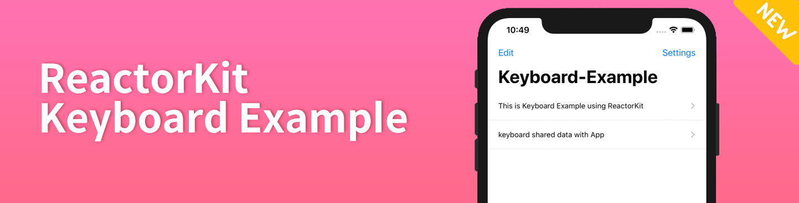
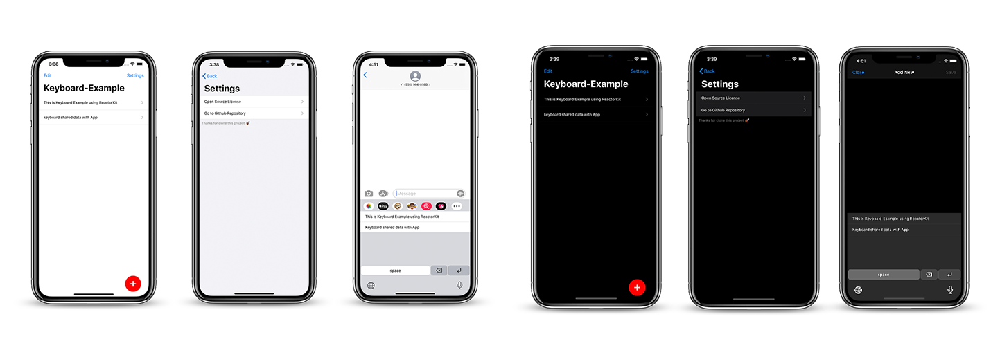

# Reactorkit-keyboard-example  

This project is ReactorKit based keyboard aplication example.

# 🐒 Features 
- 🚀 ReactorKit based.
- 🎉 iOS13 Dark mode support.
- ➕ Using cocoapods

# Quick Start 

# 📚 Skills

- Architecture

  - [ReactorKit](https://github.com/ReactorKit/ReactorKit)

- Reactive

  - [RxSwift](https://github.com/ReactiveX/RxSwift)
  - [RxDataSources](https://github.com/RxSwiftCommunity/RxDataSources)
  - [RxOptional](https://github.com/RxSwiftCommunity/RxOptional)

- UI

  - [SnapKit](https://github.com/SnapKit/SnapKit)

- etc
  - [AcknowList](https://github.com/vtourraine/AcknowList)

# ❤️ Contributing
This is an open source project, so feel free to contribute. How?

- Open an issue.
- Send feedback via email.
- Propose your own fixes, suggestions and open a pull request with the changes.
